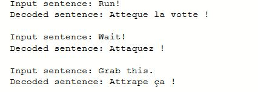
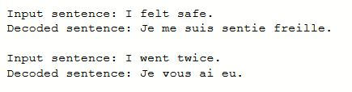

# Neural Language Translator
Sequence to sequence model for Language translation from **English to French**. 
This model uses an **Encoder-Decoder** with **LSTM** cells.

The model can similarly used for translation between other languages also like from English to Hindi.
The model was trained on a small dataset of around 8000 sentence pairs for 70 epochs.

Below are some output snapshots. 

 

#### Credits
1. The code is heavly based on 
https://blog.keras.io/a-ten-minute-introduction-to-sequence-to-sequence-learning-in-keras.html
2. Dataset was downloaded from www.manythings.org/anki and tatoeba.org
